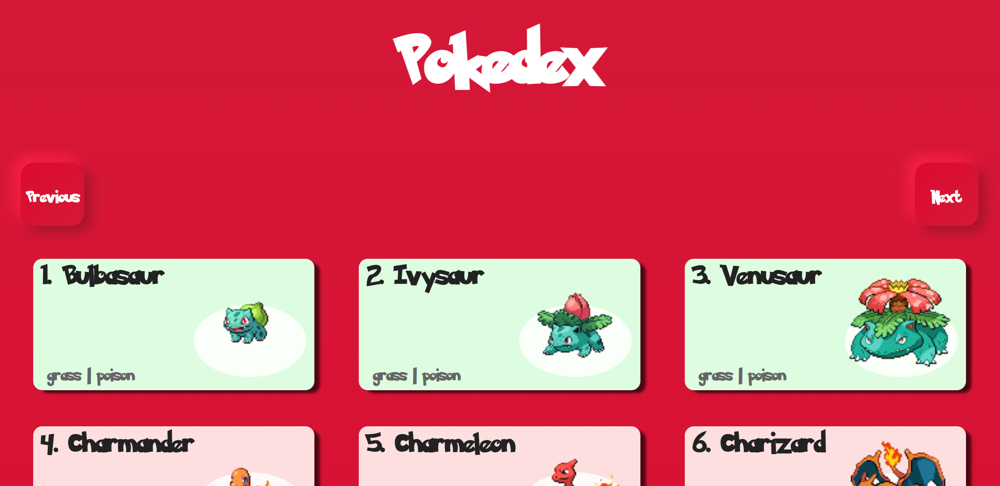

<p align="center">
  
</p>

<p align="center">
  

  

  
</p>

<h1 align="center">
    
</h1>

<br>

## 🧪 Technologies

This project was developed using the following technologies:

- [React](https://pt-br.reactjs.org)

## 🚀 Getting started

Clone the project and access the folder.

```bash
git clone https://github.com/jeffymesquita/teste-frontend-imobpower.git
cd pokedex
```


Follow the steps below:

```bash
# Install the dependencies
$ yarn install
# Start the project
$ yarn start
```

## 📝 License

This project is licensed under the MIT License. See the [LICENSE](LICENSE) file for details.

---

Made with :heartpulse: by [jeffymesquita](...) 👋
